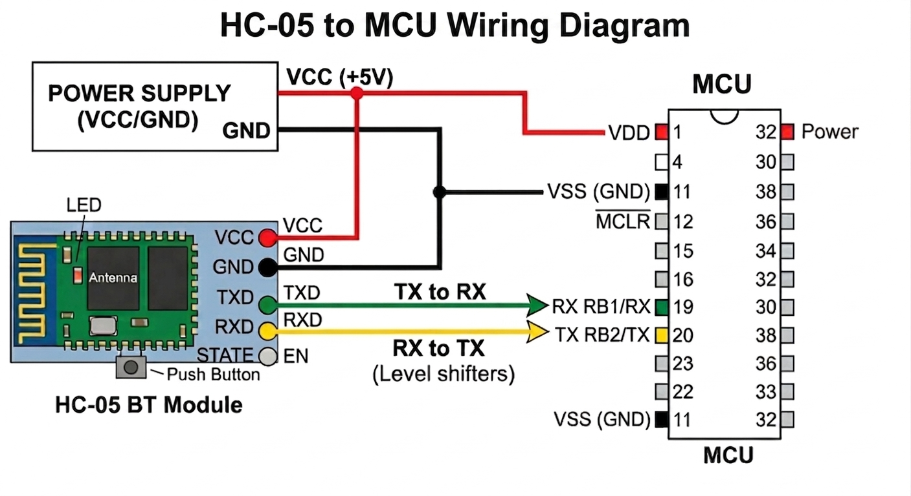

# PIC B4J Uploader (HC-05 SSP Bluetooth)
This project provides software support for **HC-05 Bluetooth modules**, enabling easy communication with microcontrollers or PCs. The software will allow users to send and receive data over Bluetooth using the **Serial Port Profile (SPP)**.

---

## Features (Planned)
- Connect to HC-05 over Bluetooth SPP  
- Send and receive data via HC-05  
- Configure HC-05 module settings via **AT commands**
- Set custom baud rates and device names  

---

## 🔌 HC-05 to Microchip Diagram

## Hardware Setup
Connect your HC-05 Bluetooth module to the PIC microcontroller as follows:

- **TX of HC-05 → RX of PIC**  
- **RX of HC-05 → TX of PIC**  
- **GND → GND**  
- **VCC → 3.3V or 5V** (depending on your HC-05 module)
- **EN** pin - Do not connect to VCC. It puts it in AT Mode on mine.
  
> **Note:** If your OS does not automatically detect the HC-05, use the B4J Uploader’s search function. Select the device and connect — Windows will then prompt that a new Bluetooth device is found. Go to the prompt and enter the password to complete pairing.”
 
> ⚠️ Ensure voltage compatibility. Most HC-05 breakout boards accept **5V on VCC**, but logic levels are typically **3.3V**.

---

### Requirements
- Power your PIC microcontroller as required (**typically 5V or 3.3V** depending on the device).  
- Ensure a **common ground** between HC-05 and PIC.  
- The PIC must have a **serial bootloader firmware pre-installed** for uploading to work.
- HC-05 must be paired with your PC first in the operating system’s Bluetooth settings
Default PIN is usually 1234 or 0000
B4J does not show a password prompt — pairing is handled entirely by the OS

---

### Notes
- TX/RX lines must be **crossed** (TX → RX, RX → TX).  
- HC-05 communicates using **UART (serial)** over Bluetooth SPP.  
- No USB-to-TTL adapter is required for normal operation — communication is **wireless via Bluetooth**.

---

## How to Use  
1. Open the **B4J Bootloader Uploader** software.
2. Select **HC-05 Bluetooth** Tab 
3. **Click Search** and let it populate the list.
4. **Select HC05** from the list and click **Connect**.
5. Wait for connection successful.
6. **Select the PIC device** you want to program.
7. Click **Load Firmware** to select the **firmware file** (.hex) you want to upload.  
8. Press **Flash** to start the programming process.  
9. Wait until the software reports **success**. Do not disconnect the device during flashing.
