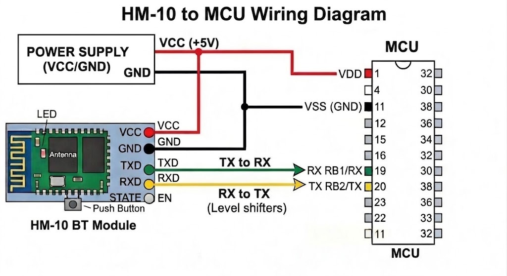

# HM-10 Bluetooth BLE
This project provides software support for **HM-10 Bluetooth modules**, enabling easy communication with microcontrollers or PCs. The software will allow users to send and receive data over Bluetooth BLE with Bleak library.

> **Note:** This software communicates via Bluetooth to serial COM ports to PIC. It requires a properly connected **HM-10 Bluetooth adapter** to the PIC target device.  Due to the 20-byte BLE MTU limit, the firmware flashing process is significantly throttled and may take a long time to complete.

---

## 🔌 HM-10 to Microchip Diagram

## Hardware Setup
Connect your `HM-10` Bluetooth module to the PIC microcontroller as follows:

- **TX of HM-10 → RX of PIC**  
- **RX of HM-10 → TX of PIC**  
- **GND → GND**  
- **VCC → 3.0V to 3.6** (depending on your HM-10 module)
- **EN** pin - Do not connect to VCC. It puts it in AT Mode on mine.
  
> ⚠️ Ensure voltage compatibility. Most `HC-08` breakout boards accept **5V on VCC**, but logic levels are typically **3.3V**.

---

### Requirements
- Power your PIC microcontroller as required (**typically 5V or 3.3V** depending on the device).  
- Ensure a **common ground** between `HM-10` and PIC.  
- The PIC must have a **serial bootloader firmware pre-installed** for uploading to work.

---

### Notes
- TX/RX lines must be **crossed** (TX → RX, RX → TX).  
- HM-10 communicates using **UART (serial)** over Bluetooth BLE.  
- No `USB-to-TTL` adapter is required for normal operation — communication is **wireless via Bluetooth**.

---

## How to Use  
1. Open the **B4J Bootloader Uploader** software.
2. 2. Select **HM-10 Bluetooth** Tab 
3. **Click Scan** and let it populate the list.
4. **Select HC08** from the list and click **Connect**.
5. Wait for connection successful.
6. **Select the PIC device** you want to program.
7. Click **Load Firmware** to select the **firmware file** (.hex) you want to upload.  
8. Press **Flash** to start the programming process.  
9. Wait until the software reports **success**. Do not disconnect the device during flashing.

## Notes  
- Make sure your `HM-10` **COM port baud rate** matches the software settings (default is usually **57600 bps**).  
- Ensure the **PIC is powered properly** before attempting to flash firmware.  

