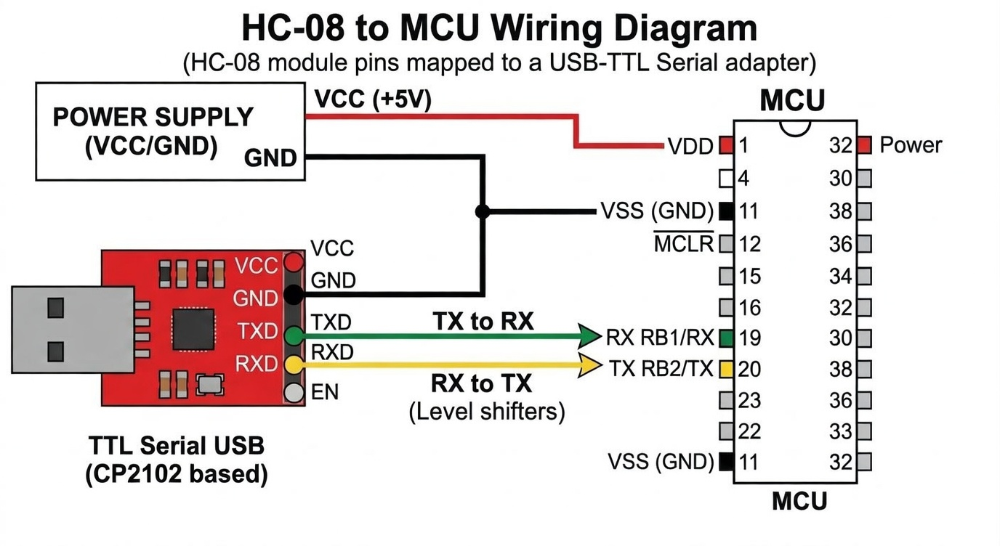
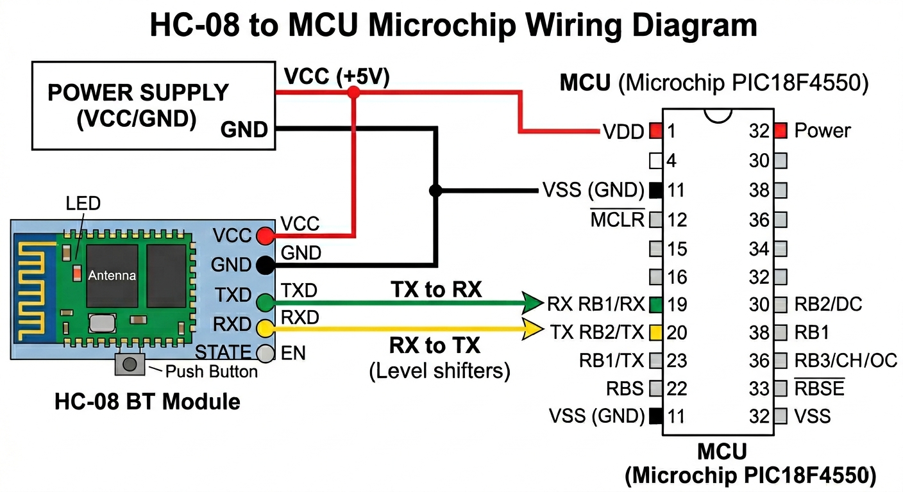
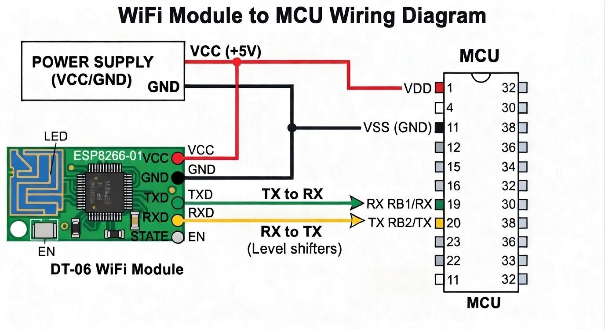
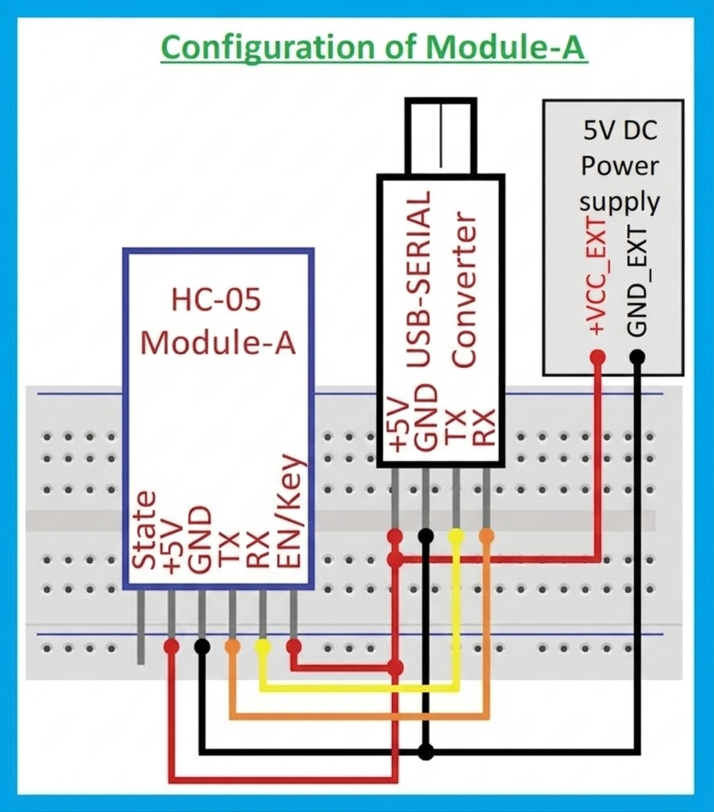

## 📋 Table of Contents
* [1. USB TTL (Serial COM)](#serial-com---ttl-usb)
* [2. HC-05 Bluetooth (SPP)](#hc-05-bluetooth-ssp)
* [3. HM-10 Bluetooth (BLE)](#hm-10-bluetooth-ble)
* [4. DT-06 WIFI (TCP/IP)](#dt-06-wifi-tcpip)
* [5. AT Command Mode](#hc-05hm-10-at-command-mode)
* [Libraries & License](#libraries-required)

---

# Serial COM - TTL USB
This software is a **simple and reliable PIC microcontroller firmware uploader**. It allows you to flash firmware to your PIC devices using a **TTL-to-USB serial connection**.  

> **Note:** This software communicates via **serial COM ports**. It requires a properly connected **TTL-to-USB adapter** to the PIC target device.  

## 🔌 TTL USB to Microchip Diagram

## Hardware Setup  
1. Connect your **TTL-to-USB adapter** to the PIC:  
   - **TX of USB → RX of PIC**  
   - **RX of USB → TX of PIC**  
   - **GND → GND**  
   - Power your PIC as required (usually 5V or 3.3V depending on your PIC).  
2. The PIC must have a serial bootloader firmware pre-installed for uploading to work.  

## How to Use  
1. Open the **B4J Bootloader Uploader** software.  
2. **Select the PIC device** you want to program.  
3. **Select the COM port** that corresponds to your `TTL-to-USB` adapter.  
4. Click **Load Firmware** to select the **firmware file** (.hex) you want to upload.  
5. Press **Flash** to start the programming process.  
6. Wait until the software reports **success**. Do not disconnect the device during flashing.  

## Notes  
- Make sure your **COM port baud rate** matches the software settings (default is usually **57600 bps**).  
- Ensure the **PIC is powered properly** before attempting to flash firmware.  
- This uploader works via **serial connection only**, using `TTL-to-USB`.  

[↑ Back to Table of Contents](#-table-of-contents)

---

# HC-05 Bluetooth SSP
This project provides software support for **HC-05 Bluetooth modules**, enabling easy communication with microcontrollers or PCs. The software will allow users to send and receive data over Bluetooth using the **Serial Port Profile (SPP)**.

> **Note:** This software communicates via Bluetooth to serial COM ports to PIC. It requires a properly connected **HC-05 Bluetooth adapter** to the PIC target device.

## 🔌 HC-05 to Microchip Diagram

## Hardware Setup
Connect your `HC-05` Bluetooth module to the PIC microcontroller as follows:

- **TX of HC-05 → RX of PIC**  
- **RX of HC-05 → TX of PIC**  
- **GND → GND**  
- **VCC → 3.3V or 5V** (depending on your HC-05 module)
- **EN** pin - Do not connect to VCC. It puts it in AT Mode on mine.
- 
> **Note:** If your OS does not automatically detect the `HC-05`, use the B4J Uploader’s search function. Select the device and connect — Windows will then prompt that a new Bluetooth device is found. Go to the prompt and enter the password to complete pairing.”
 
> ⚠️ Ensure voltage compatibility. Most `HC-05` breakout boards accept **5V on VCC**, but logic levels are typically **3.3V**.

### Requirements
- Power your PIC microcontroller as required (**typically 5V or 3.3V** depending on the device).  
- Ensure a **common ground** between `HC-05` and PIC.  
- The PIC must have a **serial bootloader firmware pre-installed** for uploading to work.
- `HC-05` must be paired with your PC first in the operating system’s Bluetooth settings
Default PIN is usually 1234 or 0000
B4J does not show a password prompt — pairing is handled entirely by the OS

### Notes
- TX/RX lines must be **crossed** (TX → RX, RX → TX).  
- HC-05 communicates using **UART (serial)** over Bluetooth SPP.  
- No `USB-to-TTL` adapter is required for normal operation — communication is **wireless via Bluetooth**.

## How to Use  
1. Open the **B4J Bootloader Uploader** software.  
2. **Click Search** and let it populate the list.
3. **Select HC05** from the list and click **Connect**.
4. Wait for connection successful.
5. **Select the PIC device** you want to program.
6. Click **Load Firmware** to select the **firmware file** (.hex) you want to upload.  
7. Press **Flash** to start the programming process.  
8. Wait until the software reports **success**. Do not disconnect the device during flashing.

## Notes  
- Make sure your `HC-05` **COM port baud rate** matches the software settings (default is usually **57600 bps**).  
- Ensure the **PIC is powered properly** before attempting to flash firmware.
  
[↑ Back to Table of Contents](#-table-of-contents)

---

# HC-08 Bluetooth BLE
This project provides software support for **HC-08 Bluetooth modules**, enabling easy communication with microcontrollers or PCs. The software will allow users to send and receive data over Bluetooth BLE with Bleak library.

> **Note:** This software communicates via  Bluetooth to serial COM ports to PIC. It requires a properly connected **HC-08 Bluetooth adapter** to the PIC target device.

## 🔌 HM-10 to Microchip Diagram

## Hardware Setup
Connect your `HC-08` Bluetooth module to the PIC microcontroller as follows:

- **TX of HM-10 → RX of PIC**  
- **RX of HM-10→ TX of PIC**  
- **GND → GND**  
- **VCC → 3.0V to 3.6** (depending on your HM-10 module)
- **EN** pin - Do not connect to VCC. It puts it in AT Mode on mine.
  
> ⚠️ Ensure voltage compatibility. Most `HC-08` breakout boards accept **5V on VCC**, but logic levels are typically **3.3V**.

### Requirements
- Power your PIC microcontroller as required (**typically 5V or 3.3V** depending on the device).  
- Ensure a **common ground** between `HM-10` and PIC.  
- The PIC must have a **serial bootloader firmware pre-installed** for uploading to work.

### Notes
- TX/RX lines must be **crossed** (TX → RX, RX → TX).  
- `HM-10` communicates using **UART (serial)** over Bluetooth BLE.  
- No `USB-to-TTL` adapter is required for normal operation — communication is **wireless via Bluetooth**.

## How to Use  
1. Open the **B4J Bootloader Uploader** software.  
2. **Click Scan** and let it populate the list.
3. **Select HM-10** from the list and click **Connect**.
4. Wait for connection successful.
5. **Select the PIC device** you want to program.
6. Click **Load Firmware** to select the **firmware file** (.hex) you want to upload.  
7. Press **Flash** to start the programming process.  
8. Wait until the software reports **success**. Do not disconnect the device during flashing.

## Notes  
- Make sure your `HM-10` **COM port baud rate** matches the software settings (default is usually **57600 bps**).  
- Ensure the **PIC is powered properly** before attempting to flash firmware.
  
[↑ Back to Table of Contents](#-table-of-contents)

---

# DT-06 WIFI TCP/IP
This project provides software support for **DT-06 WIFI modules**, enabling easy communication with microcontrollers or PCs. The software will allow users to send and receive data over TCP/IP.

> **Note:** This software communicates via WIFI to serial COM ports to PIC. It requires a properly connected **DT-06 WIFI adapter** to the PIC target device.

## **Corrected DT-06 Configuration Guide**

**1. Establish Connection**
* Connect to the DT-06 WiFi in your OS settings (usually named `DT-06_XXXXXX`).
* Open a browser and type `http://192.168.4.1` into the address bar.

**2. Configure Serial-to-PIC Communication**
* Navigate to **MODULE** > **Serial**.
* Set **BaudRate** to `57600`.
* Leave remaining fields at defaults: `8, NONE, 1, 50`.
* **Click Save.**

**3. Configure Network Protocol**
* Navigate to **MODULE** > **Networks**.
* **Socket Type:** Select `TCP Server` from the dropdown.
* **Port:** Enter `9000`.
* **Click Save.** *Note: Ensure your B4J ServerSocket is initialized to Port 9000.*

## 🔌 DT-06 to Microchip Diagram

## Hardware Setup  
Connect your `DT-06` WIFI module to the PIC microcontroller as follows:

- **TX of DT-06 → RX of PIC**  
- **RX of DT-06 → TX of PIC**  
- **GND → GND**  
- **VCC → 3.0V to 3.6** (depending on your DT-06 module)

### Requirements
- Power your PIC microcontroller as required (**typically 5V or 3.3V** depending on the device).  
- Ensure a **common ground** between `DT-06` and PIC.  
- The PIC must have a **serial bootloader firmware pre-installed** for uploading to work.

  
### Notes
- TX/RX lines must be **crossed** (TX → RX, RX → TX).  
- `DT-06` communicates using **UART (serial)** over WIFI.  
- No USB-to-TTL adapter is required for normal operation — communication is **wireless via WIFI**.

## How to Use  
1. Open the **B4J Bootloader Uploader** software.
2. Set Host IP to **192.168.4.1**
3. Set Port to **9000**  
4. **Click Connect** and wait for success connection.
5. **Select the PIC device** you want to program.
6. Click **Load Firmware** to select the **firmware file** (.hex) you want to upload.  
7. Press **Flash** to start the programming process.  
8. Wait until the software reports **success**. Do not disconnect the device during flashing. 

## Notes  
- Make sure your `DT-06` **COM port baud rate** matches the software settings (default is usually **57600 bps**).  
- Ensure the **PIC is powered properly** before attempting to flash firmware.  

[↑ Back to Table of Contents](#-table-of-contents)

---

# HC-05/HM-10 AT Command Mode
> Bootloader Uploader v8.04 now supports AT Command Mode. `DT-06` supports this mode, but use web browser option for simplicity. 

You need to set `HC05/HC08` baud to `57600` with Bootloader Uploader, alternative method online or https://www.deshide.com/News-detail_DSDTechTools.html .  The **Command Mode** allows you to configure the `HC-05` or HC-08 Bluetooth module, including changing:

- Baud rate  
- Password  
- Device name  
- Role (Master/Slave)  

## 🔌 HC-05/08 to TTL USB Diagram

### Hardware Setup
Connect your `HC-05/08` Bluetooth module to the **TTL USB** as follows:

- **TX of HC-05/08 → RX of TTL USB**  
- **RX of HC-05/08 → TX of TTL USB**  
- **GND → GND**  
- **VCC → 3.3V or 5V** (depending on your HC-05/08 module)
- **EN** → VCC

  
### Enabling AT Command Mode
`2 Ways to connect`

`OPTION 1`
1. Connect the **EN** pin of `HC-05/08` to **VCC** (Mine was 3.3v).
2. Power on the module.
   
`OPTION 2`
1. **EN** pin not needed.  Hold Button Down.
2. Power on the module and release button after 3 seconds.

`Continue from OPTION 1 or 2`
1. Should blink very slow.
2. By default, `HC-05` enters **AT command mode** at **38400 bps** and `HC-08` enters at **9600**.
3. Use the Bootloader Uploader or software https://www.deshide.com/News-detail_DSDTechTools.html
4. Change the baud rate to `57600` using the software (Note: AT command mode always uses 38400 `(HC-05)` and 9600 `(HC-08)` and is not affected).

### Common AT Commands
| Function | AT Command Example | Notes |
|----------|-----------------|-------|
| Check module | `AT` | Should respond `OK` |
| Change baud rate | `AT+UART=57600,0,0` | Sets baud rate to **57600 bps**, 1 stop bit, no parity |
| Change name | `AT+NAME=MyDevice` | Sets Bluetooth device name |
| Change password | `AT+PSWD=1234` | Sets pairing password |
| Set role | `AT+ROLE=0` | `0` = Slave, `1` = Master |

> ⚠️ **Important:** If you change the baud rate, your firmware must match it. So you need to ensure the HC-05/HC-08 baud matches your program settings.

[↑ Back to Table of Contents](#-table-of-contents)

---

### Libraries required
* jRandomAccessFile
* jSerial
* jFX
* B4XPages
* jBluetooth
* BluetoothConnection
* Bleak
* PyBridge
  

## License  
MIT License – Free to use, modify, and distribute.

[↑ Back to Table of Contents](#-table-of-contents)

