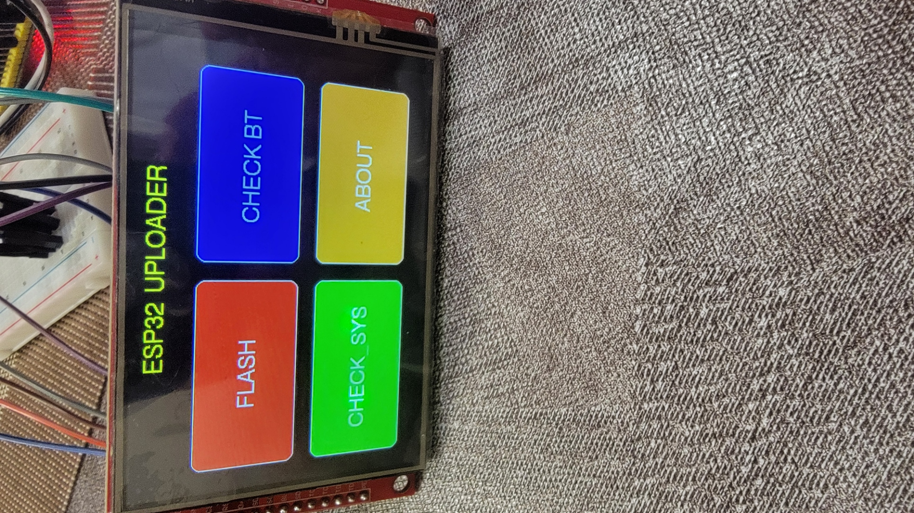
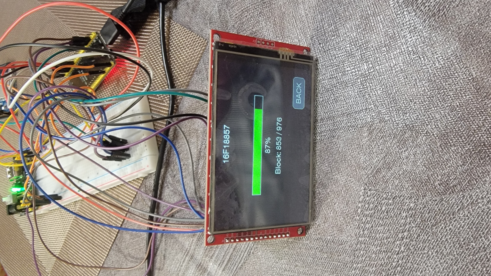
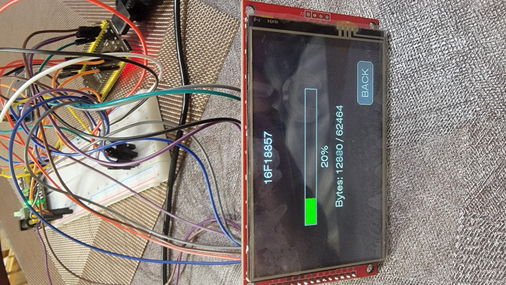
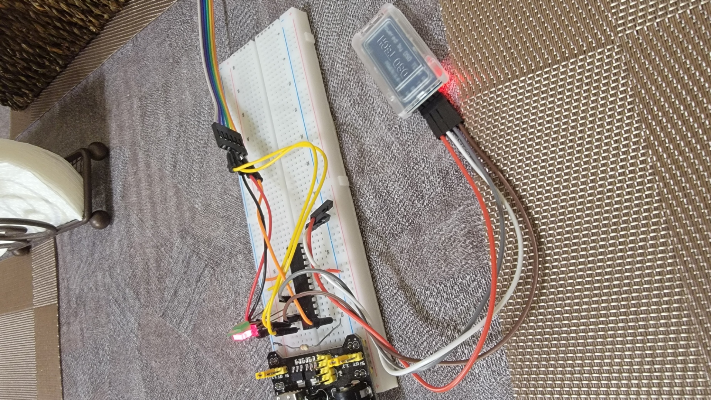
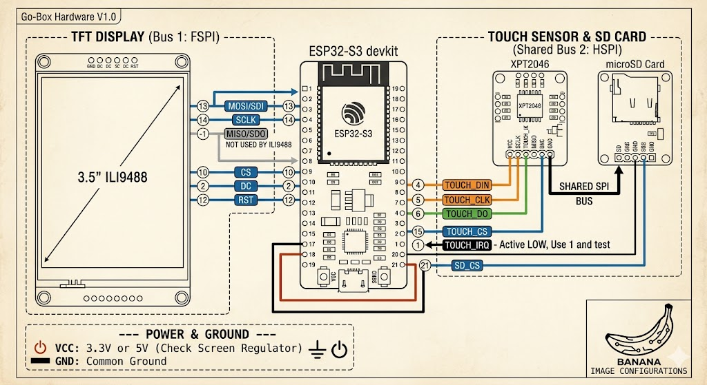

# 📺 ESP32-S3 + TFT + Touch + SD + BLE Project

---

## Screenshots

---

## 🛠 Hardware Configuration

* **MCU:** ESP32-S3
* **Display:** ILI9488 3.5" TFT
* **Touch:** XPT2046 (Resistive)
* **Storage:** MicroSD via SPI
* **BLE Device:** HM-10 BLE Adaptor

---

## 🔌 Pin Mapping (ESP32-S3)

| Function   | Pin | Bus       |
| ---------- | --- | --------- |
| TFT_MOSI   | 13  | SPI Bus 1 |
| TFT_SCLK   | 14  | SPI Bus 1 |
| TFT_MISO   | -1  | Not Used  |
| TFT_CS     | 10  | SPI Bus 1 |
| TFT_DC     | 11  | SPI Bus 1 |
| TFT_RST     | 12  | SPI Bus 1 |
| TOUCH_CS   | 15  | SPI Bus 2 |
| TOUCH_SCLK | 5   | SPI Bus 2 |
| TOUCH_MISO | 6   | SPI Bus 2 |
| TOUCH_MOSI | 4   | SPI Bus 2 |
| TOUCH_IRQ  | 1   | Interrupt |
| SD_CS      | 21  | SPI Bus 2 |

---

## 🔌 Pin Mapping (HM-10)

| HM-10 | PIC |
| ------- | ----------- |
| **TX**  | RX          |
| **RX**  | TX          |
| **GND** | VSS         |
| **VCC** | VDD      |

---

## 💻 Software Stack

* **Framework:** Arduino / PlatformIO
* **Graphics:** https://github.com/Bodmer/TFT_eSPI
* **Touch:** https://github.com/PaulStoffregen/XPT2046_Touchscreen
* **NIMBLE:** https://github.com/h2zero/NimBLE-Arduino
* **Adrafruit:** https://github.com/adafruit/adafruit_neopixel
* **IDE:** VS Code + PlatformIO

---

## ⚙️ Installation & Build

1. Clone the repository
2. Open in VS Code with PlatformIO
3. Click at bottom status bar the **right arrow** (upload) button to flash ESP32 S3.

---

Updating the application device firmware requires the ESP32 uploader tool, but bootloader must be flashed with MPLAB first:
1.  Build circuit according to schematics.
2.  SD Card requires `flash.bin` and `config.map` exported by B4J Uploader.  In B4J, select **PIC Name** from list, click **Tools->Export for ESP32**.
3.  Copy files to SD Card.
4.  With HM-10 connected to your choice of PIC.
5.  Execute the `Flash` command to flash the device.  It will Erase, Flash and Verify in that order.
6. Goto `ESP32_BootloaderUploader` directory for more information.

## Note
* You can experiment with BLE by powering on and off the HM-10 and checking the status.  Also, removing and inserting the SD Card and checking with **FLASH** button. 

