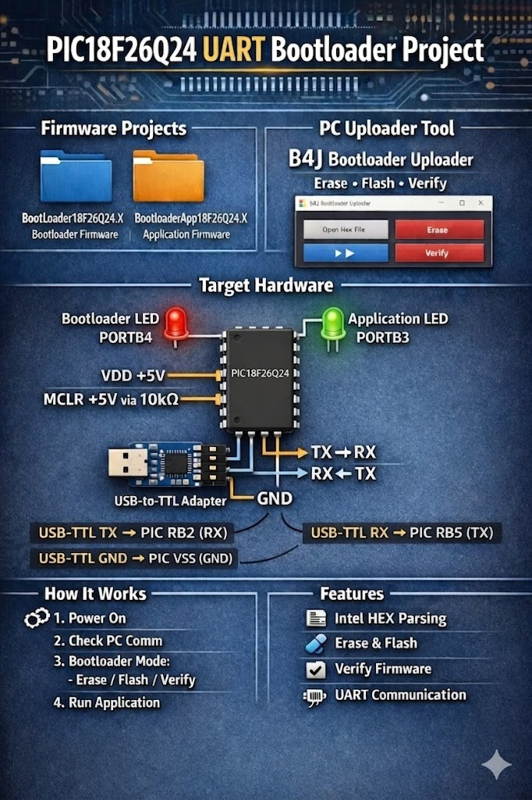
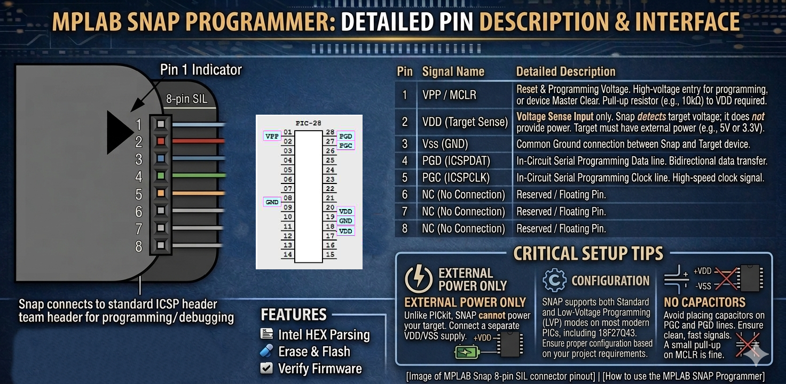

# 18F26Q24 UART Bootloader Project

This repository contains a **complete UART bootloader solution** for the **PIC18F26Q24**, including:

* MPLAB X firmware projects (bootloader + application)
* A B4J desktop uploader tool to **Erase, Flash, and Verify** the application firmware

The goal of this project is to provide a clean, understandable reference implementation of a PIC18F26Q24 bootloader with a PC-side uploader.

---

## 📂 Repository Structure

* `/BootLoader18F26Q24.X`      → MPLAB X Bootloader firmware  
* `/BootloaderApp18F26Q24.X`   → MPLAB X Application firmware
* `/Shared18F26Q24` → UART and Config.h shared
* `/B4J_BootloaderUploader`    → B4J PC uploader tool

---

## 🔧 Target Hardware

* **Microcontroller:** PIC18F26Q24
* **Programming Interface:** UART (via USB-to-TTL adapter)
* **Target Voltage:** 5V

### LED Indicators

| Function        | Port Pin |
| --------------- | -------- |
| Bootloader LED  | `PORTB.4` |
| Application LED | `PORTB.3` |

* **PORTB.4** always on or indicates when the **bootloader** is active  
* **PORTB.3** blinks and is controlled by the **application firmware**

---

## 🧠 MPLAB X Projects
I use **MPLAB X IDE 6.05** (or higher with MBLAB Snap PG164100)

### 1️⃣ BootLoader18F26Q24.X (Bootloader)
[MPLAB Ecosystem – Microchip](https://www.microchip.com/en-us/tools-resources/archives/mplab-ecosystem)

* Resides at the lower program memory
* Initializes UART communication
* Waits for commands from the PC uploader
* Supports:
  * Flash erase (64 instructions word max)
  * Application programming (64 instructions word)
  * Flash verification
* Provides visual status using **PORTB.4 LED**
* Jumps to application if no bootloader request is detected

### 2️⃣ BootloaderApp18F26Q24.X (Application)

* User application firmware
* Lives in application memory space
* Demonstrates successful boot by toggling **PORTB.3 LED**
* Can be erased and reprogrammed by the bootloader

---

## 🖥️ B4J Bootloader Uploader
[B4J – B4X](https://www.b4x.com/b4j.html)

### Libraries required

* jRandomAccess
* jSerial
* jFX
* B4XPages

### Features

* Parses **Intel HEX** firmware files
* Communicates with the PIC over UART
* Supports:
  * **Erase** application flash
  * **Flash** application firmware
  * **Verify** programmed data
* Handles word-addressed PIC flash correctly
* Designed specifically for PIC18F26Q24 bootloader protocol
* Load Firmware `BootloaderApp18F26Q24.X.production.hex` under `dist/default/production/`

---

## 🚀 How It Works (High Level)

1. PIC powers up
2. Bootloader checks for PC communication
3. If detected:
   * Enters bootloader mode
   * Accepts erase / flash / verify commands
4. If not detected:
   * Jumps to application
5. Application runs and toggles **PORTB.3 LED**

---

## 🔌 MPLAB Snap Diagram

---

## 🔌 Pin Connections

| PIC18F26Q24 Pin | Connection                       | Notes                     |
|-----------------|---------------------------------|---------------------------|
| VSS (pin 8)     | GND                              | Ground                    |
| VSS (pin 19)    | GND                              | Ground                    |
| VDD (pin 20)    | +5V                              | Power supply              |
| VDD (pin 18)    | +5V                              | Power supply              |
| MCLR (pin 1)    | +5V through 10 kΩ resistor       | Reset pull-up             |
| RB4 (pin 25)    | Bootloader LED + series resistor | LED for bootloader status |
| RB3 (pin 24)    | Application LED + series resistor| LED for application       |
| RB5 (pin 26)    | UART TX → RX on USB‑TTL          | Bootloader communication  |
| RB2 (pin 23)    | UART RX ← TX on USB‑TTL          | Bootloader communication  |
| —               | GND on USB‑TTL                   | Common ground             |

---

## 🔌 UART Connection

| USB-TTL | PIC18F26Q24 |
| ------- | ----------- |
| **TX**  | RX(RB2)          |
| **RX**  | TX(RB5)          |
| **GND** | VSS         |

> ⚠️ Ensure logic levels are **5V compatible**

---

## 🧪 Tested Setup

* PIC18F26Q24
* USB-to-TTL serial adapter [Aliexpress](https://www.aliexpress.us/w/wholesale-USB%2525252dto%2525252dTTL-serial-adapter.html?spm=a2g0o.productlist.search.0)
* HC-05 Bluetooth SSP adapter [Aliexpress](https://www.aliexpress.us/w/wholesale-hc05-bluetooth-module.html?osf=auto_suggest&spm=a2g0n.productlist.header.0)
* MPLAB X IDE [MPLAB Ecosystem – Microchip](https://www.microchip.com/en-us/tools-resources/archives/mplab-ecosystem)
* B4J (Anywhere Software) [B4J – B4X](https://www.b4x.com/b4j.html)

---

## 📌 Notes

* Bootloader and application are **separate MPLAB X projects**
* Designed for clarity and learning, not maximum flash compression
* Code is intentionally readable and well-structured

---

## 📜 License

Open-source. Use, modify, and learn from it freely.

---

## ✨ Author

Issac  

Enjoy hacking the PIC18F26Q24 🚀
