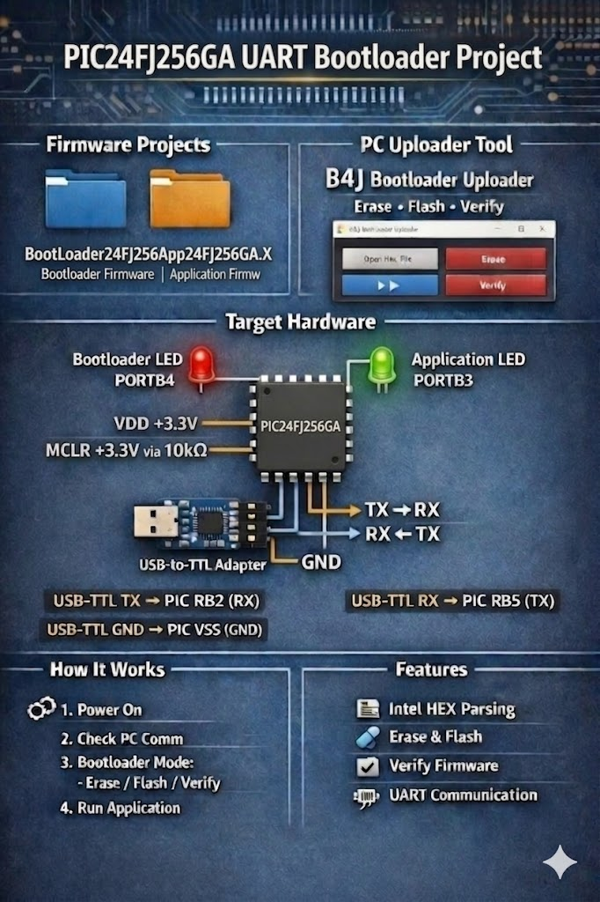
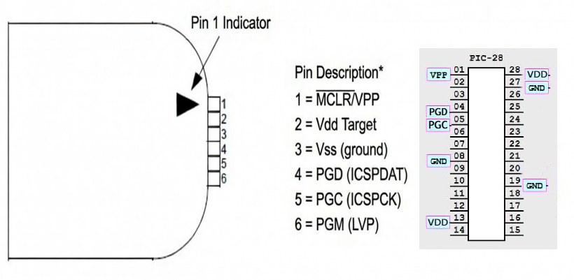

# PIC24FJ256GA702 UART Bootloader Project

This repository contains a **complete UART bootloader solution** for the **PIC24FJ64GA102**, including:

* MPLAB X firmware projects (bootloader + application)
* A B4J desktop uploader tool to **Erase, Flash, and Verify** the application firmware

The goal of this project is to provide a clean, understandable reference implementation of a PIC24FJ64GA102 bootloader with a PC-side uploader.

---

## 📂 Repository Structure

* `/BootLoader24FJ256GA702.X`      → MPLAB X Bootloader firmware  
* `/BootloaderApp24FJ256GA702.X`   → MPLAB X Application firmware  
* `/BootloaderUploader/B4J` → B4J PC uploader tool

---

## 🔧 Target Hardware

* **Microcontroller:** PIC24FJ256GA702
* **Programming Interface:** UART (via USB-to-TTL adapter)
* **Target Voltage:** 3.3V

### LED Indicators

| Function        | Port Pin |
| --------------- | -------- |
| Bootloader LED  | `PORTB.4` |
| Application LED | `PORTB.3` |

* **PORTB.4** always on or indicates when the **bootloader** is active  
* **PORTB.3** blinks and is controlled by the **application firmware**

---

## 🧠 MPLAB X Projects
I use **MPLAB X IDE 6.05** (supports Pickit 3/3.5 if using this!)

### 1️⃣ BootLoader24FJ256GA702.X (Bootloader)
[MPLAB Ecosystem – Microchip](https://www.microchip.com/en-us/tools-resources/archives/mplab-ecosystem)

* Resides at the lower program memory
* Initializes UART communication
* Waits for commands from the PC uploader
* Supports:
  * Flash erase (512 Instructions max)
  * Application programming 64 Instructions (256 bytes with phantom)
  * Flash verification
* Provides visual status using **PORTB.4 LED**
* Jumps to application if no bootloader request is detected

### 2️⃣ BootloaderApp24FJ256GA702.X (Application)

* User application firmware
* Lives in application memory space
* Demonstrates successful boot by toggling **PORTB.3 LED**
* Can be erased and reprogrammed by the bootloader

---

## 🖥️ B4J Bootloader Uploader
[B4J – B4X](https://www.b4x.com/b4j.html)

### Libraries required

* jRandomAccess
* jSerial v1.40
* jFX
* B4XPages

### Features

* Parses **Intel HEX** firmware files
* Communicates with the PIC over UART
* Supports:
  * **Erase** application flash
  * **Flash** application firmware
  * **Verify** programmed data
* Handles word-addressed PIC flash correctly
* Designed specifically for PIC24FJ256GA702 bootloader protocol
* Load Firmware `BootloaderApp24FJ256GA702.X.production.hex` under `dist/default/production/`

---

## 🚀 How It Works (High Level)

1. PIC powers up
2. Bootloader checks for PC communication
3. If detected:
   * Enters bootloader mode
   * Accepts erase / flash / verify commands
4. If not detected:
   * Jumps to application
5. Application runs and toggles **PORTB.3 LED**

---

## 🔌 Pickit 3/3.5 Diagram

---

## 🔌 Pin Connections

| PIC24FJ256GA702 Pin | Connection                      | Notes                    |
|-------------|---------------------------------|--------------------------|
| VSS (pin 8) | GND                             | Ground                   |
| VSS (pin 19) | GND                             | Ground                   |
 VSS (pin 27) | GND                             | Ground                   |
| VDD (pin 28)| +3.3V                             | Power supply             |
| VDD (pin 13)| +3.3V                             | Power supply             |
| MCLR (pin 1)| +3.3V through 10 kΩ resistor       | Reset pull-up            |
 VCAP (pin 20) | 10µF Capacitor to GND                            | MANDATORY                   |
| RB4 (pin 11)| Bootloader LED + series resistor | LED for bootloader status|
| RB3 (pin 7) | Application LED + series resistor| LED for application      |
| RB5 (pin 14)| UART TX → RX on USB‑TTL         | Bootloader communication |
| RB2 (pin 6) | UART RX ← TX on USB‑TTL         | Bootloader communication |
| GND         | GND on USB‑TTL                  | Common ground            |

Note: Do not use 5 volts

---

## 🔌 UART Connection

| USB-TTL | PIC24FJ256GA702 |
| ------- | -------- |
| **TX**  | RX(RB2)       |
| **RX**  | TX(RB5)       |
| **GND** | VSS      |

> ⚠️ Ensure logic levels are **3.3V compatible**

---

## 🧪 Tested Setup

* PIC24FJ256GA702
* USB-to-TTL serial adapter [Aliexpress](https://www.aliexpress.us/w/wholesale-USB%2525252dto%2525252dTTL-serial-adapter.html?spm=a2g0o.productlist.search.0)
* MPLAB X IDE [MPLAB Ecosystem – Microchip](https://www.microchip.com/en-us/tools-resources/archives/mplab-ecosystem)
* B4J (Anywhere Software) [B4J – B4X](https://www.b4x.com/b4j.html)

---

## 📌 Notes

* Bootloader and application are **separate MPLAB X projects**
* Designed for clarity and learning, not maximum flash compression
* Code is intentionally readable and well-structured

---

## 📜 License

Open-source. Use, modify, and learn from it freely.

---

## ✨ Author

Issac  

Enjoy hacking the PIC24FJ256GA702 🚀
